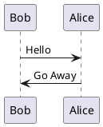
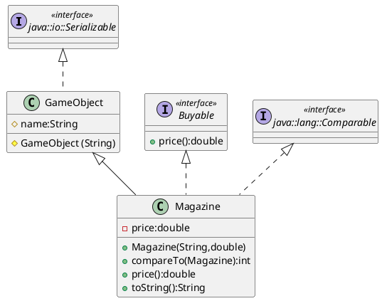

# Markdown Kurzeinführung

## Strukturierung

```markdown
# Section
## Sub Section
### Sub Section
#### Sub Sub Section
##### Sub Sub Sub Section
###### Sub Sub Sub Sub Section
```

## Formatierung

*italic*, **bold**, ***bold-italic***
```markdown
*italic*, **bold**, ***bold-italic***
```

Dieser Text wurde _mit dem Unterstrich hervorgehoben_ und dieser *mit dem Sternchen*.
```markdown
Dieser Text wurde _mit dem Unterstrich hervorgehoben_ und dieser *mit dem Sternchen*.
```

Für __fetten Text__ benutzt man **zwei** Zeichen.
```markdown
Für __fetten Text__ benutzt man **zwei** Zeichen.
```

Variablen_namen_ können Unterstriche enthalten, daher benutzt man zum hervor*heben* das Sternchen.
```markdown
Variablen_namen_ können Unterstriche enthalten, daher benutzt man zum hervor*heben* das Sternchen.
```

H~2~O ist Wasser

2^10^ ist 1024

2^2^^2^ ist 2^22^

```markdown
H~2~O ist Wasser
2^10^ ist 1024
2^2^^2^ ist 2^22^
```

~~Strikethrough text~~
```markdown
~~Strikethrough text~~
```

## Mathematik

### Inline

$2^{2^2} != 2^{22}$
```markdown
$2^{2^2} != 2^{22}$
```

### Equations

\begin{equation}\label{eq:neighbor-propability}
    p_{ij}(t) = \frac{\ell_j(t) - \ell_i(t)}{\sum_{k \in N_i(t)}^{} \ell_k(t) - \ell_i(t)}
\end{equation}
```markdown
\begin{equation}\label{eq:neighbor-propability}
    p_{ij}(t) = \frac{\ell_j(t) - \ell_i(t)}{\sum_{k \in N_i(t)}^{} \ell_k(t) - \ell_i(t)}
\end{equation}
```

## Abbildungen

### Abbildungen mit Caption und Label

{#fig:logo}
```markdown
{#fig:logo}
```

Siehe Abbildung {@fig:logo} für weitere Informationen.
```markdown
Siehe Abbildung {@fig:logo} für weitere Informationen.
```

### Abbildungen im Fließtext

Aliquam sollicitudin felis orci, eget facilisis ligula sagittis vehicula. Phasellus congue eu tellus non aliquet. Aenean efficitur ante eu libero auctor eleifend. Pellentesque vitae metus vitae quam dignissim sollicitudin. Integer laoreet orci ac faucibus iaculis. Aliquam venenatis at metus sit amet luctus. Das  im Fließtext. Maecenas nec mattis nunc, eu rutrum risus. Nullam eu lacus id nunc dictum mattis vitae bibendum orci. Ut finibus luctus urna et varius. Duis viverra viverra nisl et efficitur. Mauris tincidunt accumsan odio at suscipit. Phasellus a ornare dui, sit amet placerat eros. Quisque faucibus faucibus lacus, et scelerisque urna iaculis ac.

### PlantUML



~~~{#plantuml1 .puml caption="PlantUML Beispiel 1"}
@startuml
Bob -> Alice : Hello
Alice -> Bob : Go Away
@enduml
~~~



~~~{#plantuml2 .puml caption="PlantUML Beispiel 2"}
@startuml

interface java::io::Serializable << interface >>
class GameObject{
#name:String
#GameObject (String)
}
interface Buyable <<interface>> {

+price():double
}

interface java::lang::Comparable <<interface>>
class Magazine{
-price:double
+Magazine(String,double)
+compareTo(Magazine):int
+price():double
+toString():String
}

java::io::Serializable   <|..GameObject
java::lang::Comparable <|.. Magazine
Buyable <|.. Magazine
GameObject <|-- Magazine

@enduml
~~~

## Tabellen

| Rechts | Links | Standard | Zentriert | 
|-------:|:------|----------|:---------:| 
|    12  | 12    | 12       |     12    | 
|   123  | 123   | 123      |    123    |
|     1  | 1     | 1        |     1     |

Table: Einfache Tabelle mit Caption und Label. {#tbl:table1}

Siehe Tabelle {@tbl:table1} für weitere Details.

  Right     Left     Center     Default
-------     ------ ----------   -------
     12     12        12            12
    123     123       123          123
      1     1          1             1

Table: Noch eine einfache Tabelle mit Caption und Label. {#tbl:table2}

Siehe Tabelle {@tbl:table2} für weitere Details.

## Verweise / Cross-References

Siehe Abbildung {@fig:logo} für weitere Informationen.
```markdown
Siehe Abbildung {@fig:logo} für weitere Informationen.
```

Siehe Tabelle {@tbl:table1} für weitere Details.
```markdown
Siehe Tabelle {@tbl:table1} für weitere Details.
```

Siehe Tabelle {@tbl:table2} für weitere Details.
```markdown
Siehe Tabelle {@tbl:table2} für weitere Details.
```

Siehe Abschnitt [Formatierung] für weitere Informationen.
```markdown
Siehe Abschnitt [Formatierung] für weitere Informationen.
```

## Aufzählungen / Listen

### Itemize Liste / Unordered List

* eins
* zwei
* drei
    - drei 1
    - drei 2
* vier

```markdown
* eins
* zwei
* drei
    - drei 1
    - drei 2
* vier
```

### Enumerate Liste / Ordered List

1. eins
2. zwei
3. drei
    1. drei 1
    2. drei 2
4. vier

```markdown
1. eins
2. zwei
3. drei
    1. drei 1
    2. drei 2
4. vier
```

### Description Liste

Gelse
  : ein kleines Tier, das östlich des Semmering Touristen verjagt.
  
Gemse
  : ein großes Tier, das westlich des Semmering von Touristen 
    verjagt wird.
    
  : Langer Absatz über die Frage ob es Gemsen oder Gämsen heißt.
  
Gürteltier
  ~ ein mittelgroßes Tier, das hier nur wegen der Länge seines 
    Namens vorkommt.
  ~ Gürteltiere sind in Österreich außerhalb von Zoologischen 
    Gärten selten anzutreffen.

```markdown
Gelse
  : ein kleines Tier, das östlich des Semmering Touristen verjagt.
  
Gemse
  : ein großes Tier, das westlich des Semmering von Touristen 
    verjagt wird.
    
  : Langer Absatz über die Frage ob es Gemsen oder Gämsen heißt.
  
Gürteltier
  ~ ein mittelgroßes Tier, das hier nur wegen der Länge seines 
    Namens vorkommt.
  ~ Gürteltiere sind in Österreich außerhalb von Zoologischen 
    Gärten selten anzutreffen.
```

## Quellcode Listings

```java
public class Example implements LoremIpsum {
	public static void main(String[] args) {
		if(args.length < 2) {
			System.out.println("Lorem ipsum dolor sit amet");
		}
	} // Obscura atque coniuge, per de coniunx
}
```

~~~{#test .java caption="Listing mit Caption"}
public class Example implements LoremIpsum {
	public static void main(String[] args) {
		if(args.length < 2) {
			System.out.println("Lorem ipsum dolor sit amet");
		}
	} // Obscura atque coniuge, per de coniunx
}
~~~

## Literatur Verweise

Dieser Artikel erschien in [@Ziele-dtk; @Ziele-TUGboat; @Ziele-ct]
```markdown
Dieser Artikel erschien in [@Ziele-dtk; @Ziele-TUGboat; @Ziele-ct]
```

## Fußnoten

Dies ist eine Fußnotenmarkierung[^1] und dies eine 
weitere[^2].

[^1]: Hier ist der Fußnotentext

[^2]: Diese Fußnote ist etwas länger.

    Sie enthält einen zweiten Absatz.

```markdown
Dies ist eine Fußnotenmarkierung[^1] und dies eine 
weitere[^2].

[^1]: Hier ist der Fußnotentext

[^2]: Diese Fußnote ist etwas länger.

    Sie enthält einen zweiten Absatz.
```

## Links

[NetworkedAssets](https://networkedassets.com)

<https://networkedassets.com>

Die Dokumentation zu pandoc befindet sich auf der
[pandoc Webseite](http://johnmacfarlane.net/pandoc/).

```markdown
[NetworkedAssets](https://networkedassets.com)

<https://networkedassets.com>

Die Dokumentation zu pandoc befindet sich auf der
[pandoc Webseite](http://johnmacfarlane.net/pandoc/).
```

## Rohes Latex

TBD ...
